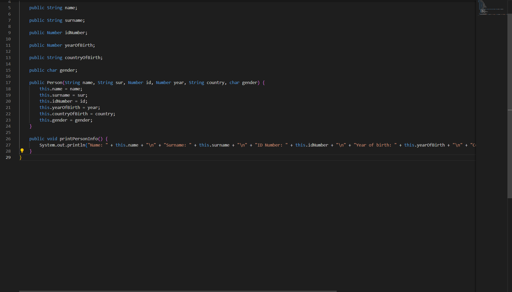
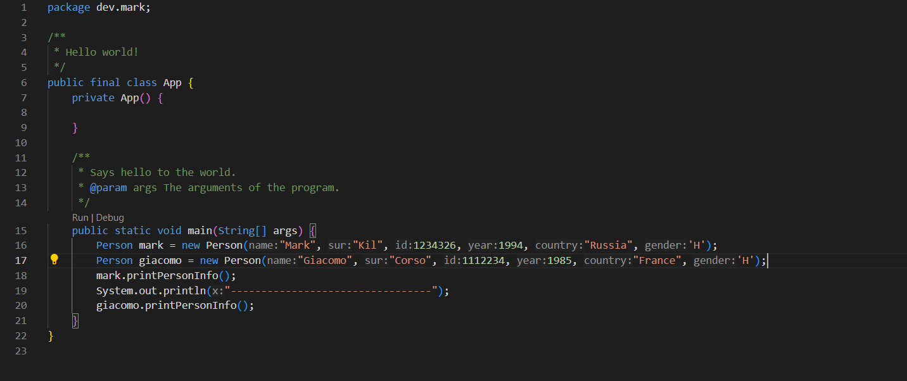

# Java classes exercise by Factoria F5

The objective of this exercise is to create a class that would represent a person and then create 2 persons and print their info on the console.

## Screenshots

## Thank you!